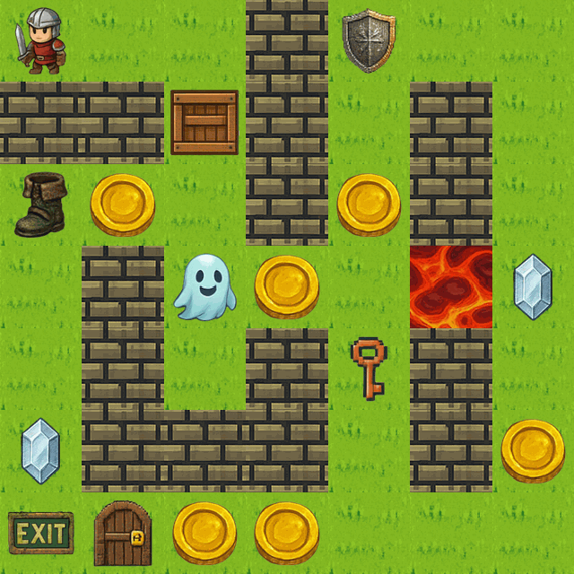
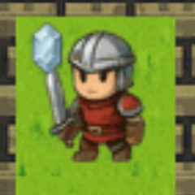
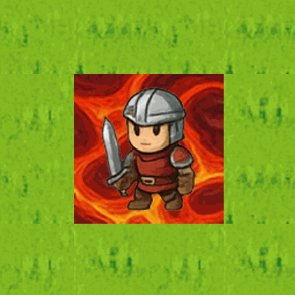

# Image Rendering

##
When the grid is rendered, the image will be populated with all the entities present. For more information on the different entities and their appearances, please refer to the [Player Guide](../player-guide/entities.md). An example of a rendered grid is shown below.

## Rendering Constraints
All grids start with no overlapping entities, in order to reduce the number of possible states an agent must consider when interpreting an `ImageObservation.image`. The only exception is Floor tiles, which may overlap with other entities and always appear in the background.

**Note**: Entities may overlap during the game when the agent walks onto tiles containing collectible items or other background entities.

## Overlapping Entities
### Agent with collectible items
When overlapping the agent with collectible items such as Gem, Coin, Key or any Power-ups, the collectible item will be minimised and shown in the top left of the grid cell.

### Agent with background entities
When overlapping Agent with background entities, such as Lava, Unlocked Door, Exit & Floor, the Agent will be positioned before the background entity.

