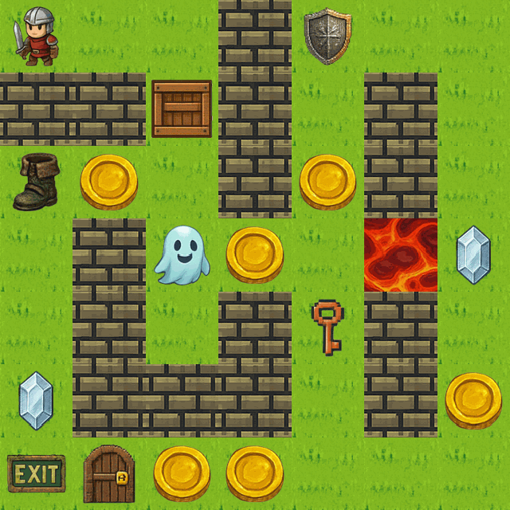

# Grid Adventure

Welcome to **Grid Adventure**, a flexible, grid-based game in which you implement an **agent** that interacts with diverse gameplay mechanics to fulfil objectives.

## Objective

Grid Adventure is a **turn-based** game played on a 2D grid of tiles. The agent can start at any location on the grid. To win, it must **collect all gems** on the grid (if any) and **reach the exit tile** with the lowest cost possible. The agent has 5 health by default, but a level can configure a different amount. It loses if its HP drops to **0**. Some levels also limit the number of turns.



## Mechanics

In one turn, the agent takes exactly one **action**: move to an adjacent tile (up/down/left/right), pick up an item, use a key, or wait.

Scoring works as follows:

- All actions except the final action give a reward of **-3**. The final action gives no reward.
- Each coin collected gives a reward of **+5**.

## The objects

| Object | Role |
|---|---|
| **Agent** | The character you control. It has 5 health by default. |
| **Wall** | Blocks the agent from moving past. |
| **Exit** | The tile the agent must reach to finish. |
| **Gem** | Must be collected. All gems are required before the agent can win at the exit. |
| **Coin** | Optional. Collecting one gives a reward of 5. |
| **Key and Door** | Any key unlocks a locked door, but each key is used only once. |
| **Box** | Can be pushed onto a tile without a blocking, pushable, or collidable entity. |
| **Lava** | Deals 2 damage when the agent occupies it during an action. |
| **Powerups** | Speed, Shield, and Phasing. They give temporary boosts. |

See [Entities](game/entities.md) for the appearance and behavior of each object, and [Powerups & Effects](game/powerups.md) for how powerup limits work.

## Your turn

You write an **Agent** class that plays the game. Your agent keeps whatever internal state it needs, and each turn it decides what to do in its `step` method, which returns an **[Action](game/actions-and-movement.md)**:

```python
from grid_adventure.actions import Action


class Agent:
    def __init__(self):
        # Set up anything your agent needs to remember.
        ...

    def step(self, obs) -> Action:
        # Look at the observation and decide the next action.
        ...
```

Each turn your agent receives an **observation** (a snapshot of the game) and returns an action:

> observation -> step() -> action -> new observation -> ...

See [Building Your Agent](agent/agent-class.md) for the full Agent interface, including the optional `parse` and `info` methods for debugging in Grid Play.

## Where to go next

Read these sections to learn the details and build your agent:

- [Entities](game/entities.md): the objects you will encounter in the grid
- [Actions & Movement](game/actions-and-movement.md): how the agent moves and interacts with objects
- [Objectives & Rewards](game/objectives-and-rewards.md): what you must accomplish to win, and how score works
- [Powerups & Effects](game/powerups.md): temporary boosts and how their limits work
- [Building Your Agent](agent/agent-class.md): the Agent class, observations, and the environment
- [Testing in Grid Play](grid-play/index.md): run and debug your agent in the browser

## Two tools, one project

**Grid Adventure** is the game and the Python environment your agent plugs into (the [Agent Class](agent/agent-class.md), [Observations](agent/observations.md), and the [Environment](agent/environment.md)).

**[Grid Play](grid-play/index.md)** is a browser playground for playing levels and running your agent step by step. It displays the agent's chosen actions and optional debugging output.

Use the tabs above to navigate the documentation.
