All objects available in Grid-Adventure-V1 are shown below. Each entity is displayed in five slightly different visuals. Many other appearances exist that are similar but differ subtly from those shown.

## Floor

Floor is the basic tile of the grid. Other entities can be present on floor tiles.

## Agent

Agent is the character that you will control and play as. It appears in the grid as a human. You will move around the grid, interact with objects and aim to complete the objective.

In 1 turn, the Agent can either move to an adjacent tile (Up/Down/Left/Right), pickup a item or use a key to unlock a door.
The agent starts with some health points and you will lose if the HP drops to 0.

## Wall

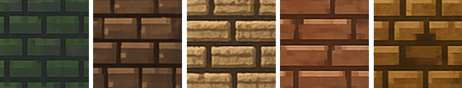

Walls can be present on the grid and blocks the agent from moving past it.

## Exit

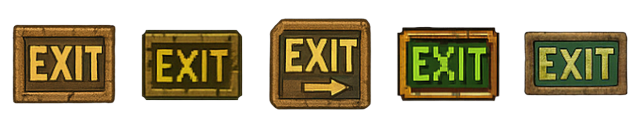
 
This is the final escape tile that the agent needs to land on to complete the objective.

## Coin

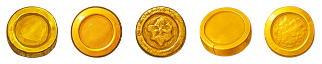

Coin is a optional item that can be picked up on the grid. The agent may collect the coin to reduce total cost by 5.

## Gem

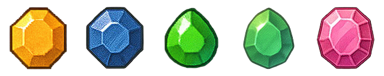

Gem is an item on the grid that needs to be picked up. If there are any gems present, all of them need to be collected by the agent before moving to the exit tile to complete the objective.

## Key

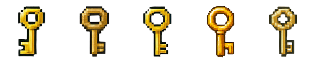

Key is an optional item on the grid that can be picked up by the agent. A key is required to unlock a door. Any key can be used to unlock a door, but each key can only be used once.

## Door

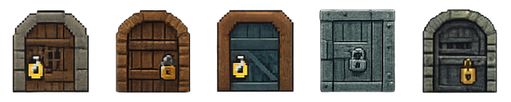

A locked door blocks the agent from moving past it. To unlock a door, the agent first needs to collect a key. Using the key while standing adjacent to the door unlocks it and it becomes an unlocked door. The agent can freely pass through unlocked doors. Unlocked doors appear on the grid as shown below.
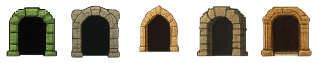

## Box

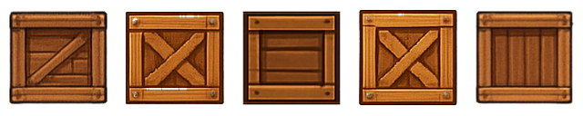

Box is an item on the grid that can be moved by the agent. The agent can push a box in any direction onto a free tile. Boxes cannot be pushed onto walls, doors or lava.

## Lava

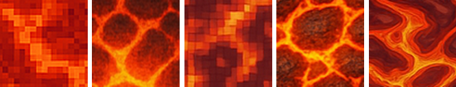

Lava tiles inflict damage to the agent. When the agent lands on lava, 2 damage is dealt. The player loses if agent HP drops to 0.

## Powerups

Powerups can also be present on the grid and can be picked up by the agent if wanted. They provide a boost and are associated with a turn or usage limit.

## Powerup-Speed

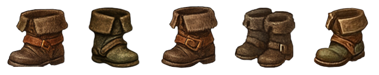

The speed powerup allows the agent to move 2 tiles in 1 turn. It has a 5 turn limit. Note that the agent can still be blocked by any objects in its way.

## Powerup-Shield

Shield protects the agent from damage taken. It has a usage limit of 5. The shield is used once every time the agent lands on lava.

## Powerup-Phasing

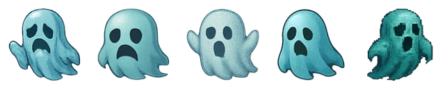

Phasing allows the agent to move through objects. It has a turn limit of 5. While the powerup is active, the agent can move through walls and doors. The agent does not take damage from lava as well.
