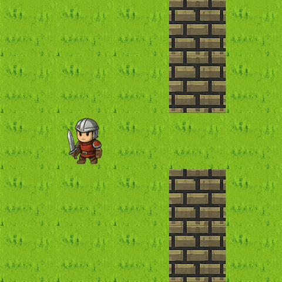
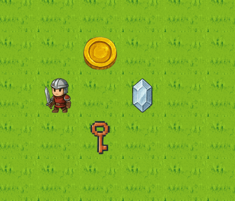
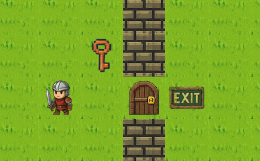
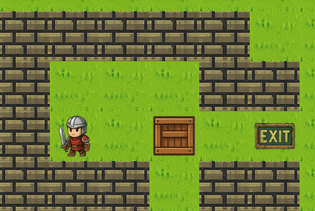
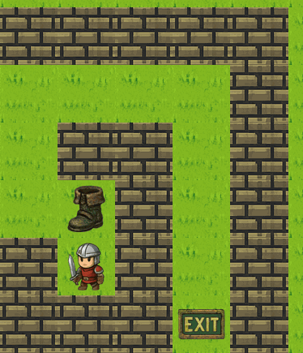

## Basic movements

In a turn, the agent can move to adjacent tiles (Up/Down/Left/Right)

The demo shows the agent performing basic movements.

## Collecting items

If the agent is on the same tile as any collectible items, the Agent can use a turn to pick it up.

The demo shows the agent picking up items such as keys, gems and coins.

## Key and Door

To unlock a door, the agent must first collect a key, then move to and unlock the door from an adjacent tile.

The demo shows the agent collecting the key, then unlocking the door to be able to pass through.

## Box

To push a box, Agent needs to stand adjacent to the Box and move in the direction to push the Box.

The demo shows the agent pushing the box aside to be able to reach the exit tile.

## Powerup-Speed

Speed allows the agent to move 2 tiles in 1 turn. It lasts for 5 turns.

The demo shows the agent movement once boots are picked up. Note that walls can still restrict the agent from moving 2 tiles. After 5 turns, the agent exhausts the powerup and returns to 1 tile per turn.

## Powerup-Shield

Shield allows the agent to move through lava without taking damage. It has 5 uses.

In this demo, the agent health has been set to 1, so landing on lava will result in a loss. Thus, the agent collects the shield powerup to pass through 3 lava tiles and reach the exit.

## Powerup-Phasing

Phasing powerup allows the agent to move through objects such as walls and doors. It lasts for 5 turns.

In this demo, the agent collects the phasing powerup to pass through the walls and reach the exit tile.

