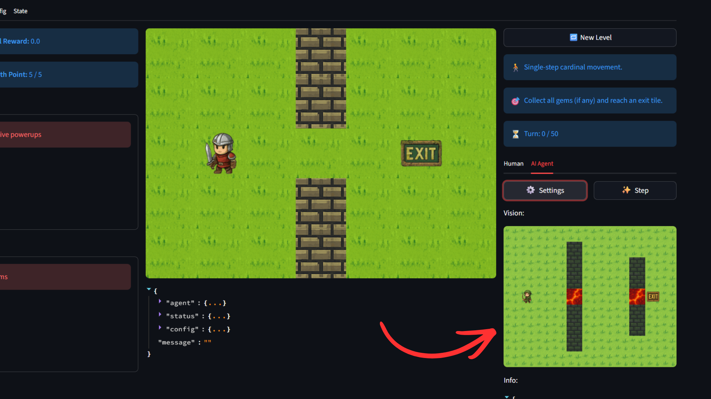
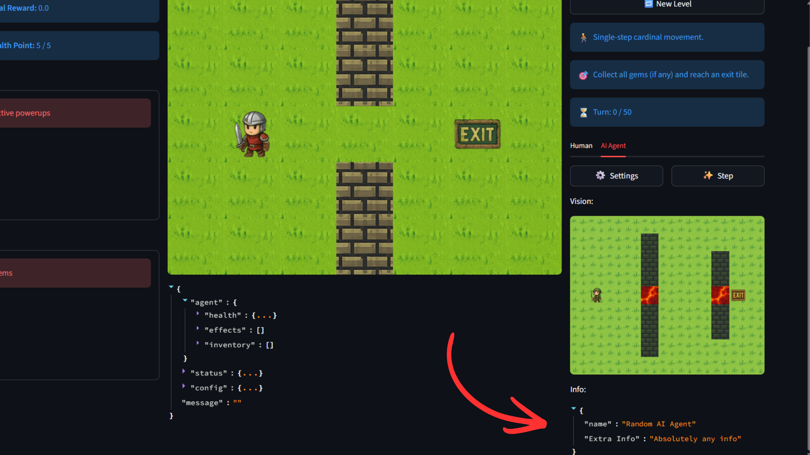

#Agent Class

## Agent Class Template
The agent class will be the Api for submission for the capstone project. It consists of 2 compulsory functions, and 2 optional functions for debugging. 

| Function | Description |
| -- | -- |
|`__init__(self) -> None`| Initialising Function |
|`step(self, state: GridState | Observation) -> Action`| Function used to generate Action given a game representation. This should be the "Brains" of your agent. |
|`def parse(self, obs: ImageObservation) -> GridState` | Optional function used in GridPlay to help visualise what your agent sees |
|`def info(self) -> dict[str, Any]`| Optional function used in GridPlay to help visualise any other info |

&nbsp;
## `__init__ function`
This initialising function will be ran to initialise your agent class before use. 

**Tips**: Use this function to declare any internal variables used by your agent

&nbsp;
## `step(self, state: GridState | Observation) -> Action`
This step function is called in the main turn loop of the Grid Adventure game. Your implementation of this function, acts as the "Brains" of your agent, to make informed decisions on the next action based on the provided state.

&nbsp;
## `def parse(self, obs: ImageObservation) -> GridState`
This parse function is **optional** to be implemented. If implemented, function will be called with the initial level in ImageObservation representation, it will then create generate a window in Grid Play in the bottom right of the screen, for visualising the GridState generated by this function.

**Tips**: Implement the image parsing of your agent using this function. This allows you to catch its mistake in predicting the gridstate.

&nbsp;
## `def info(self) -> dict[str, Any]`
This info function is **optional** to be implemented. If implemented, each turn, Grid Play will display the information in of the dictionary

**Tips**: Use this function to provide a window into internal variables of your agent at every step of the game.